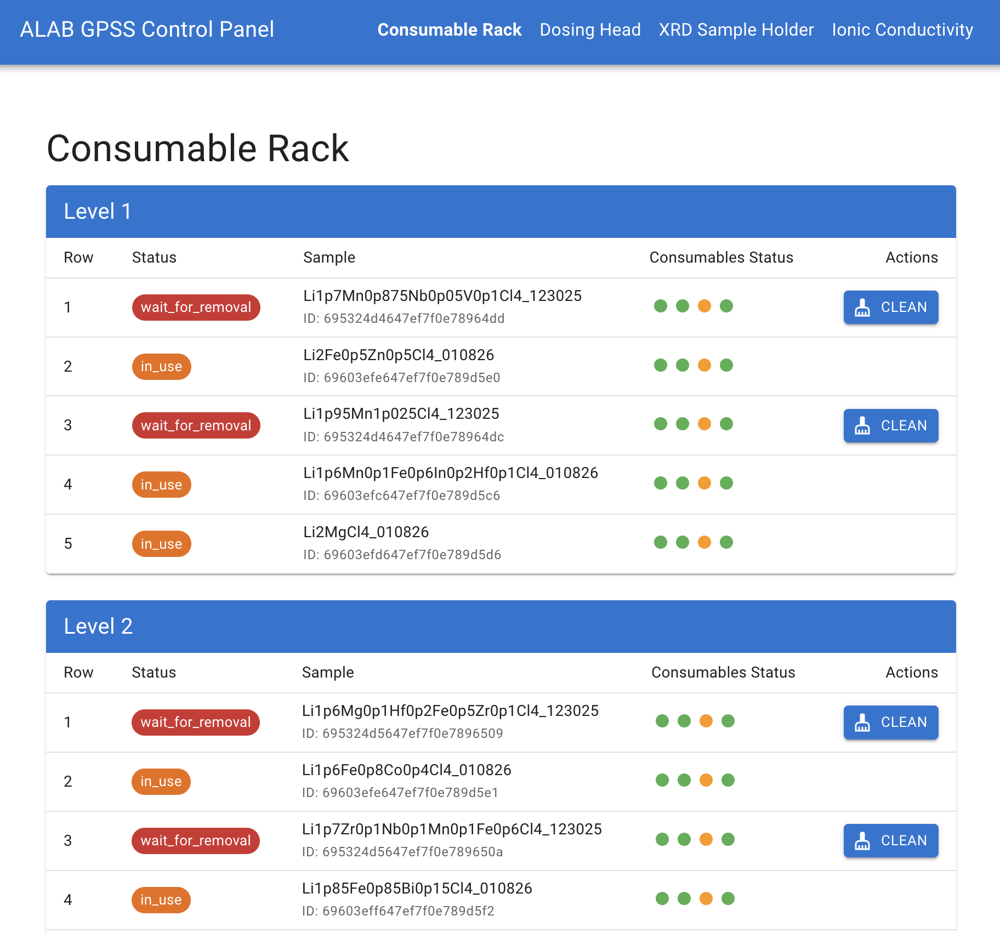
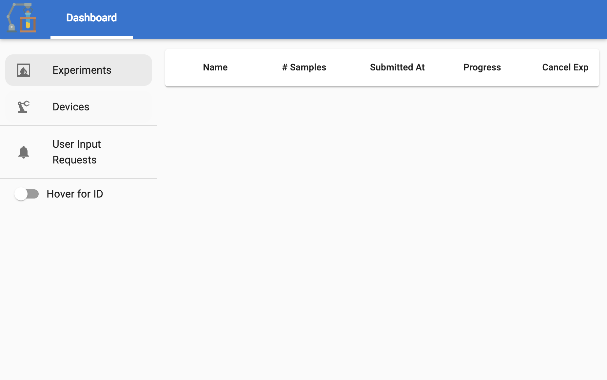

# ALAB GPSS

Control code for the A-Lab GPSS platform.

This repository includes:
- Hardware device and task orchestration: `alab_gpss.system`
- Sample-management backend and UI: `alab_gpss.backend`, `alab_gpss/ui` (FastAPI + React)

## Who this is for

Use this module-level package when you want to:
- Run the local/simulated GPSS service stack
- Access the sample-management UI and AlabOS integration
- Submit and monitor experiments through the standard interfaces

## How to run the code
Before starting services:
1. Install MongoDB and RabbitMQ.
2. Ensure both services are running.

Set the environment variable so AlabOS can find the configuration file:

```bash
export ALABOS_CONFIG_PATH=system/alabos_config_example.toml
```

Open three terminals and start the three services provided by AlabOS + A-Lab GPSS.
You need `ALABOS_CONFIG_PATH` set in all three terminals.

```bash
alabos launch  # alabos main process
alabos launch_worker  # alabos worker process

python -m alab_gpss.backend.server  # alab_gpss sample management user interface
```

Service roles:
- `alabos launch`: Main AlabOS process
- `alabos launch_worker`: Worker process for background execution
- `python -m alab_gpss.backend.server`: GPSS backend/UI server

### What you will see
After all services start, two webpages should be available:

- http://localhost:8000

  This is the sample-management interface. Use it to track sample status and position, and to trigger manual measurements (for example, starting XRD/EIS measurements).



- http://localhost:8895

  This is the AlabOS main interface. Submit experiments here to run them on the lab.



### Job submission
AlabOS provides API endpoints for experiment management.
For details, see the [AlabOS documentation](https://cedergrouphub.github.io/alabos/).

To submit an experiment to A-Lab GPSS, refer to [submit_template.ipynb](submit_template.ipynb).

## Clean up the database
If you need a fresh start, you can clean the database with the command below.
Do not run this against a production database.

```bash
alabos clean -a
```
