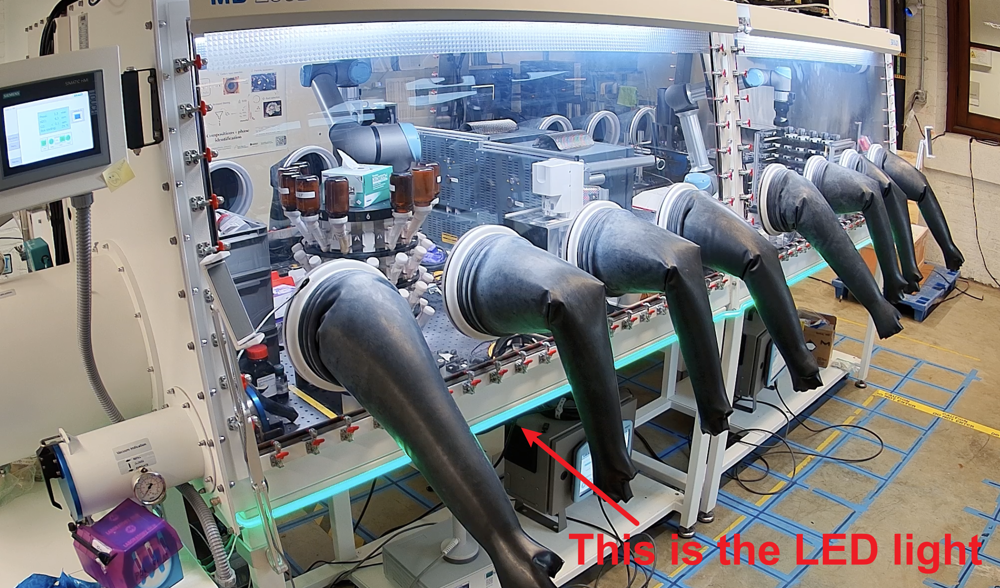

# Daemons
This folder contains daemon processes used to monitor lab state and trigger operational actions.
These daemons run on a standalone Raspberry Pi 4B in A-Lab GPSS.

## What each daemon does

- `gpss_light_monitor`
  - Reads lab status and supply gas pressure
  - Updates LED lights to reflect current operational state
- `gpss_height_caliper`
  - Listens to a Bluetooth caliper input device
  - Sends measured sample height updates to the backend
- `gpss_qrcode_scanner`
  - Listens to a USB scanner input device
  - Sends scanned sample IDs to trigger ionic conductivity measurement

## gpss_light_monitor
This daemon is used to monitor the status of the lab and change the light of the lab accordingly. Something like below

### LED color status mapping
The monitor checks user-input state (from AlabOS) and supply gas pressure, then sets one lab-wide light state with priority from highest severity to lowest.

| Color / mode | Brightness | Status meaning | Trigger condition |
|---|---:|---|---|
| `red` | 100 | Unrecoverable error | Any user prompt contains `"A unrecoverable error has occurred."` |
| `orange` | 100 | Maintenance mode | Any active user input under `Maintenance` |
| `blue` | 100 | Supply gas pressure low | Glovebox supply gas pressure `< 50 PSI` |
| `purple` | 80 | Supply gas pressure high | Glovebox supply gas pressure `> 85 PSI` |
| `yellow` | 40 | Normal user-input activity | Any non-maintenance user input exists |
| `working` (green DIY scene) | 40 | Normal operation | No active user input and no pressure alarm |
| `white` (`white-off`) | 2 | AlabOS is down | `get_user_input_from_alabos()` returns `None` |

If the color is not green, it means there is something wrong with the lab.

## gpss_height_caliper
This daemon is used to listen on the height caliper for measuring the sample height for the EIS measurement. The caliper is connected to the Raspberry Pi via Bluetooth as a keyboard device. When the user double-presses the SEND button, the height will be sent to the backend via HTTP request. The height will be updated in the database.

This is the caliper we get ([link](https://www.mcmaster.com/4996A61/)).

## gpss_qrcode_scanner
This daemon is used to scan the QR code on the sample and start the EIS measurement. The scanner is connected to the Raspberry Pi via 2.4GHz USB dongle. When the user scans the QR code, the sample ID will be sent to the backend via HTTP request and the BioLogic is notified to start the measurement. In the end, the measurement data will be saved under the sample with sample ID in the MongoDB database.

The QR code scanner we use is [link](https://www.netum.net/products/netum-c990-bluetooth-2d-qr-barcode-scanner-wireless-compatible-small-pocket-usb-1d-2d-qr-code-scanner-for-inventory-bar-code-image-reader-for-tablet-iphone-ipad-android-ios-pc-pos?srsltid=AfmBOoo-mbA1OilVm3RdWVRBxXUeWHdx1YPMEUnJpogLEFFe8a6oumzE).

